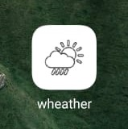
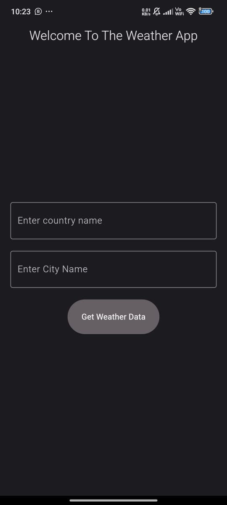
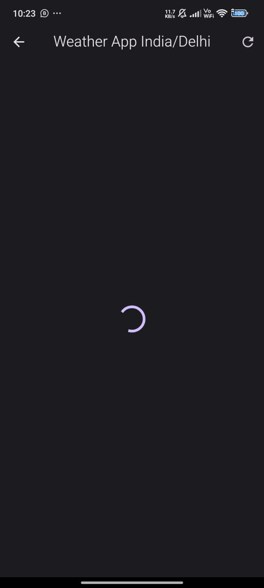
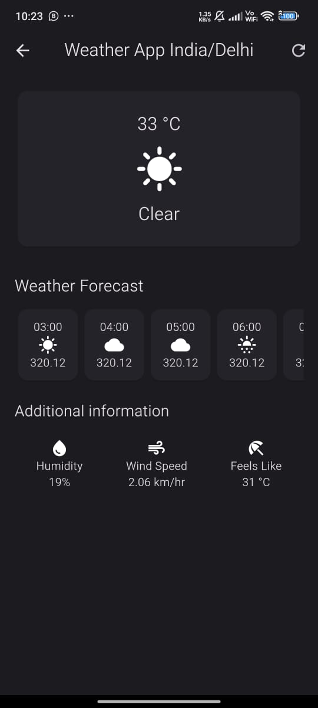

# Weather App 

A Simple Basic Weather App   Built with  Flutter
and Dart that is basically a Weather App  its provideing you any country or State Current Temperature  Wind Speed and Humidity .

## Features

- Providing The Current Temperature
- Providing The Current Wind Speed
- Providing The Current Humidity 
- Responsive 

## Screenshots

###

<!--  -->

## Getting Started

 Follow these instructions to get a copy of the project up and running on your local machine.

### Prerequisites

 - Flutter (SDK)
 - Android Studio with SDK Tools and Emulator
 - Java Development Kit (JDK for android development)
 - All These Application Must Be Installed in your System Before Starting The Application and also Set In your System Environment Variable

### Checking Your Flutter App Setup Command
flutter doctor

 ### Installing
 1. Clone the repository:

 git clone https://github.com/ssdevloper/Weather_App.git

 ### Setup Command

 cd Weather_App
 
 flutter pub get 

 flutter pub outdated

 ### Run Command

 flutter run

 

### Author

Shubham Singh